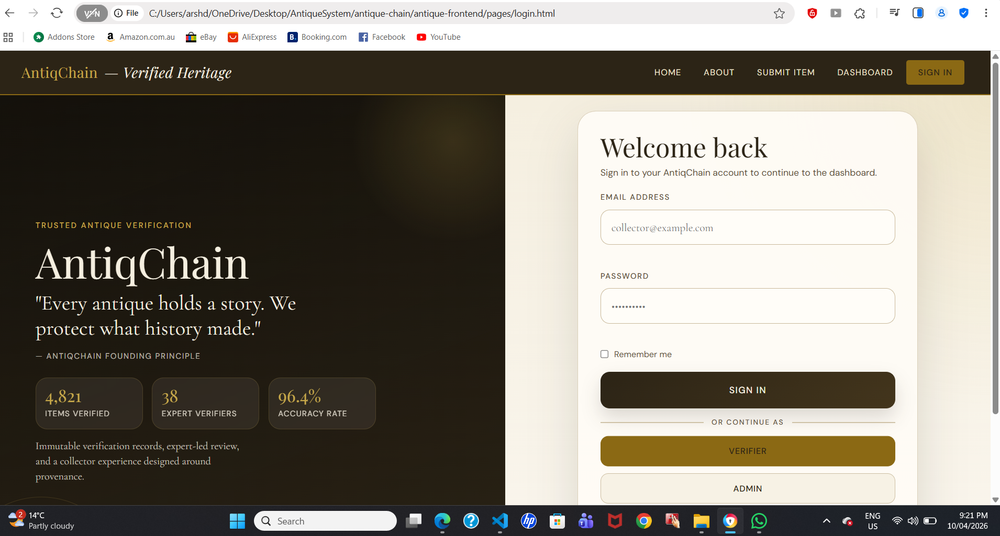
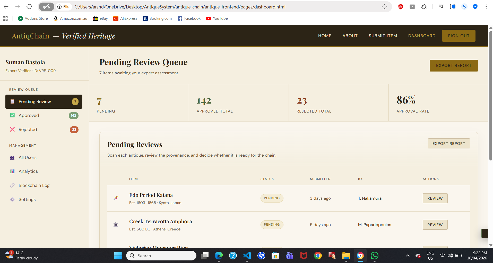

# AntiqChain – Front-End Development (ICT308 Capstone Project 2)

##  Project Overview
AntiqChain is a web-based platform developed to address the growing issue of counterfeit antiques by providing a digital system for authentication and verification. The system aims to enhance trust, transparency, and traceability in antique transactions.

This project focuses on front-end development as part of ICT308 Capstone Project 2. It demonstrates the practical implementation of user interface design, client-side validation, session management, and access control using modern web technologies.

##  Project Objectives
- Develop a clean and user-friendly interface  
- Implement authentication and validation mechanisms  
- Ensure secure access control using client-side techniques  
- Provide a responsive design for multiple devices  
- Enhance overall user experience through interactive features  

##  Technologies Used
- HTML5 – Structure of web pages  
- CSS3 – Styling and layout design  
- JavaScript – Functionality and interactivity  
- Visual Studio Code – Development environment  
- GitHub – Version control and collaboration  
- Live Server – Real-time testing  

##  Project Structure

AntiqueSystem/
│
├── antique-chain/
├── antique-backend/
├── antique-frontend/
│   │
│   ├── index.html
│   ├── README.md
│   ├── .gitignore
│   │
│   ├── css/
│   │   ├── about.css
│   │   ├── auth.css
│   │   ├── dashboard.css
│   │   ├── detail.css
│   │   ├── global.css
│   │   ├── home.css
│   │   └── submit.css
│   │
│   ├── js/
│   │   ├── utils.js
│   │   ├── assets/
│   │   │   └── images/
│   │   │       ├── login-ui.png
│   │   │       └── dashboard-ui.png
│   │
│   ├── pages/
│   │   ├── about.html
│   │   ├── dashboard.html
│   │   ├── detail.html
│   │   ├── login.html
│   │   ├── submit.html

##  Key Features Implemented

###  Authentication System
- User registration and login functionality  
- Input validation to prevent empty or incorrect submissions  
- Error handling for invalid credentials  

###  Page Protection
- Restricted access to protected pages using localStorage  
- Automatic redirection for unauthorized users  

###  Session Management
- “Remember Me” functionality for persistent login  
- Session handling using browser storage  

###  Logout System
- Secure logout functionality  
- Clears session data and redirects user  

###  User Experience Enhancements
- Dynamic welcome message after login  
- Smooth navigation between pages  
- Interactive UI elements (hover effects)  

##  UI/UX Design and Style Guide
The system follows a consistent and user-centred design approach:

- **Colour Scheme:** Cream background with gold accents for a premium look  
- **Typography:** Clean and readable fonts for better usability  
- **Layout:** Card-based dashboard design for better content organisation  
- **Responsiveness:** Fully responsive across mobile, tablet, and desktop  

##  Development Process
The development followed an iterative approach:

1. Designed initial UI layouts (login and dashboard)  
2. Implemented authentication system  
3. Added validation for forms and inputs  
4. Developed page protection logic  
5. Integrated session management features  
6. Enhanced UI/UX design and responsiveness  
7. Implemented logout functionality  
8. Performed continuous testing and debugging  

GitHub was used for version control, allowing tracking of progress through commits.

##  Testing
The system was tested under multiple scenarios:

- Login with valid and invalid credentials  
- Access restriction for protected pages  
- Session persistence using “Remember Me”  
- Logout functionality validation  
- UI responsiveness across different screen sizes  

##  Screenshots

###  Login Page 

### Dashboard

##  Limitations
- Authentication is implemented using localStorage, which is not fully secure  
- No backend integration for data storage and validation  
- No encryption or advanced security mechanisms  

## Future Improvements
- Backend integration using Node.js and MongoDB  
- Secure authentication using JWT  
- Blockchain integration for antique verification  
- Role-based access control  

##  Contribution Table :
 Author - Arshdeep Kaur
- Designed and improved login page UI  
- Implemented login validation and fixed input issues  
- Developed page protection using localStorage  
- Implemented “Remember Me” functionality  
- Built logout system with session clearing  
- Enhanced dashboard UI with interactive elements  
- Added validation to antique submission form  
- Implemented dynamic welcome message 
- Added  Screenshots 

Author- Suman Bastola

Volunteered to go beyond job scope, formulated and submitted five blackbelt business process improvements—two implemented later across five hospital facilities. 

A Shift in Strategy. 

To ensure the database can handle the flexible data requirements of different categories of antiques, I led the migration of the system’s data layer from a relational SQL model to MongoDB. 

Schema Architecture: I designed document schemas for six core entities: Users, Antiques, Authenticity Requests, Verification Reports, Certificates, Antique Images. 

To further improve the system’s performance and reduce the number of complex "joins", we embedded the Verification Reports directly into the Authenticity Requests and the Antique Images within the Antique documents. 

Additionally, I ensured the database structure supported the authentication lifecycle from owner submission through expert review and finally to certificate rendering. 

I also wrote the updated database section of the report, rewriting the entity-relational-database (ERD) concepts to represent a document-based relationship model, as well as replacing the SQL CREATE TABLE statements with MongoDB’s JSON schemas. 

## 🔗 GitHub Repository
https://github.com/phuanh20001/AntiqueSystem.git

---

##  Conclusion
The AntiqChain front-end system demonstrates a well-structured implementation of web development concepts, including authentication, validation, and session management. The project reflects a strong focus on usability, design consistency, and client-side security, providing a solid foundation for future backend and blockchain integration.
